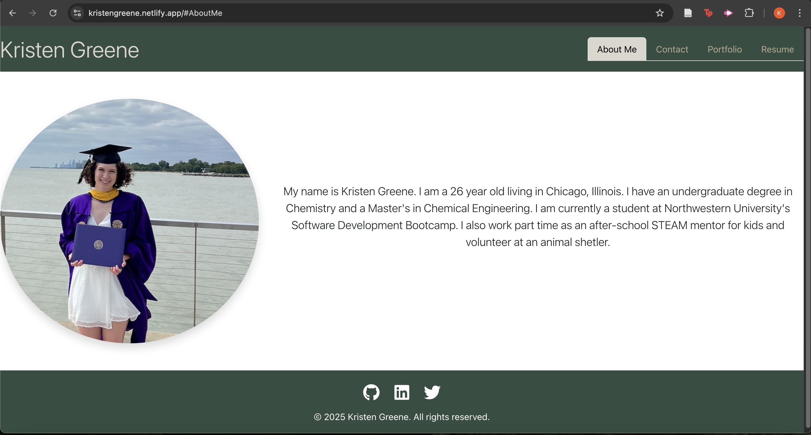

# React Portfolio

## Description

This application uses React to build a single page developer portfolio. Using React allows the application to make use of a single component multiple times, such as the Header, Navigation, Project, and Footer comonents in this application. This portfolio site includes an About Me, Contact, Portfolio, and Resume sections. The portfolio section makes use of a project component to display pictures and links to the Github repositories for a number of different projects. The resume section lists developer proficiencies and allows for the user to download a copy of the developer's resume. 

## Links

[Deployed](https://kristengreene.netlify.app/)

 

[Github](https://github.com/kagreene/React-portfolio)

